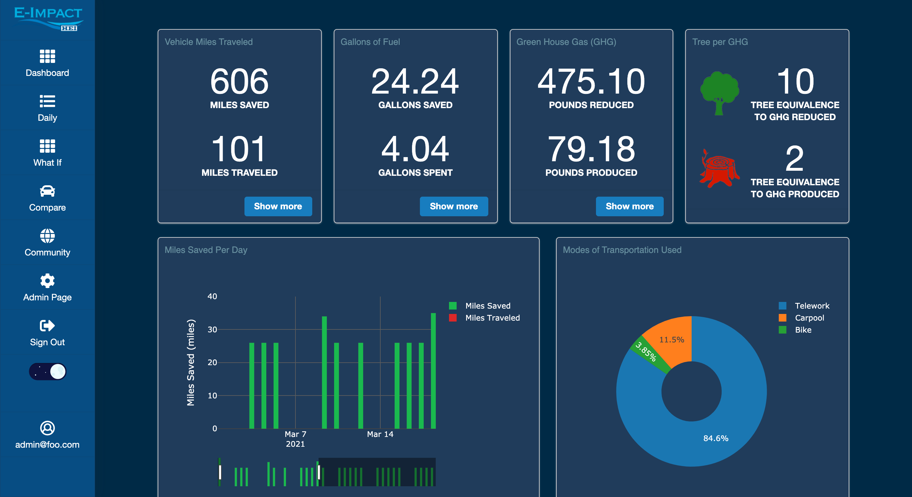
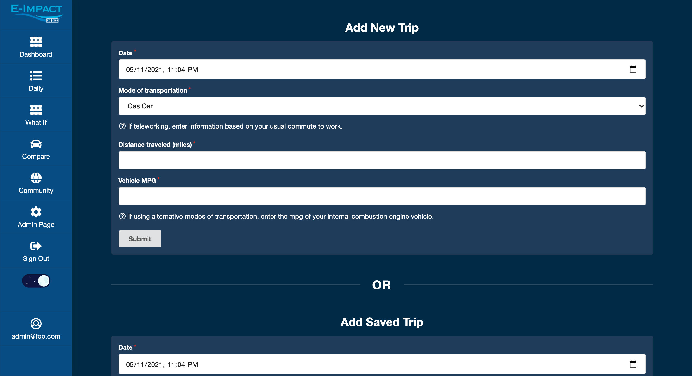
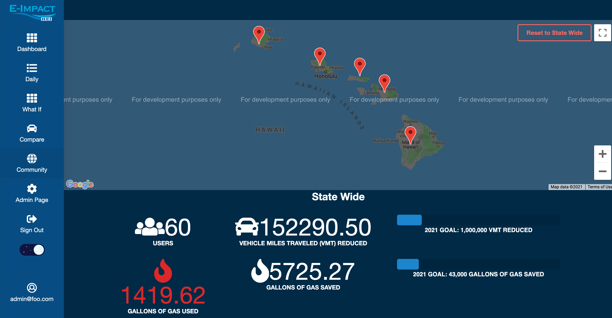

<h3>Meet the Client</h3>
E-Impact was made in collaboration with [Hawaiian Electric Industries](https://www.hei.com/home/default.aspx), a holding company that focuses on advancing Hawaii's sustainability goals and enhancing the lives of the community.

<h3>Our Goal</h3>
Our team, comprised of eight students, was tasked with producing a solution to the following client request:

Create a convenient, easy to use GHG transportation app/instrument that can inspire our community to take personal action to reduce greenhouse gas emissions from transportation, including transitioning to other modes of transportation or moving towards the adoption of electric vehicles.

GHG Tracker
  - Ability to input information daily and translate to climate-related metrics
  - Takes into consideration the alternative modes of travel, such as biking, walking, alternative fuel vehicles, car-pooling, or public transportation
  - Dashboard for individuals and a roll-up for the community to track progress

<h3>Our Product</h3>
Thus, E-Impact was born. Our web application seeks to inform and engage the public about the importance of reducing greenhouse gas emissions from transportation. The application allows users to login and log their trips. The users can then track their progress via the Dashboard which shows data on Vehicle Miles Traveled/Reduced, Fuel Used/Saved, and GHG Produced/Reduced. Users can also view these information on the State and county level and see how their actions are making a difference. See below for screenshots of some of the app's pages.

Dashboard Page

Add Trip Page

Community Page

<h3>Main Takeaways</h3>
Although we all contributed to overseeing the whole project, members were also assigned specific tasks and roles. My main task was to create and develop the Community Page. I enjoyed learning and implementing new tools to make the app more interactive. Working on E-Impact also helped me improve my communication skills. I gained confidence in sharing my ideas and appreciated receiving feedback from the team and the client. It was an exciting experience to see our work come to fruition.

You can view the project source code and learn more at our [Organization GitHub Page](https://environment-overflow.github.io./).

