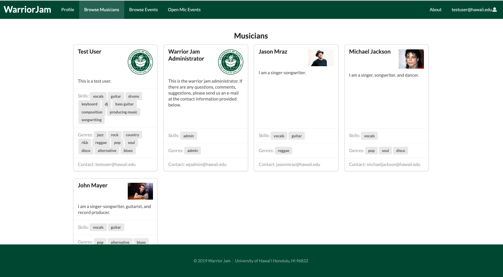

We, a team of 4 students, were tasked with producing a solution to the following problem:

Many UH students have musical talents, but there is no easy way for them to find others with similar tastes and compatible musical abilities. They cannot experience the fun of informal jam sessions which could progress into performing musical groups.

Thus, WarriorJam was born. Our web application aims to connect talented students and staff.  The application allows students to login and create a profile indicating their musical tastes, their musical capabilities, and their musical goals (from occasional, informal jam sessions to performing bands). Users can also share their music content. After creating a profile, users can then browse through other musician profiles and events such as open mic night or band member auditions. Now, students and staff have a site that allows them to contact compatible musicians and find information about upcoming musical events in the community. See below for screenshots of some of the app's pages.

Browse Musicians Page

Browse Events Page

Although we all contributed to overseeing the whole project, we also assigned members specific tasks and roles. My tasks included creating the profile and add event forms, the browse events page, and the collections. I enjoyed working on this project because I got to try new things such as front-end and back-end development. I improved and gained new skills as a developer. For this project we experienced using UI Design Frameworks and REACT, databases on MongoDB, application design on Meteor and app deployment on Galaxy. Aside from the technical skills, I also learned how to resolve issues by asking [smart questions](https://lcaraang.github.io/essays/smart-questions.html) and effectively work in a team through the implementation of agile project management. 

You can view the project source code and learn more about it at our [Organization GitHub Page](https://warrior-jam.github.io./).
